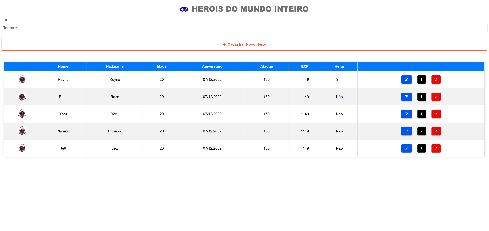
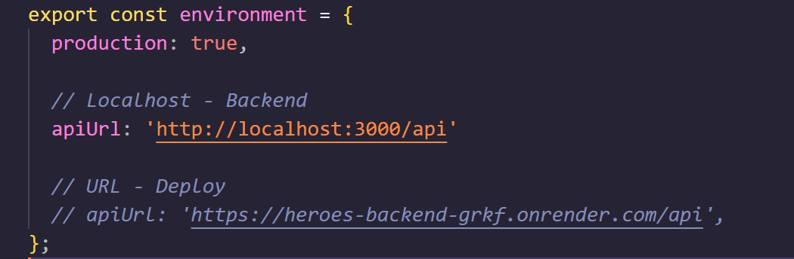

# Heroes - Frontend
Aplicação de Cadastro e Consulta de Heróis que Salvam o Mundo

<h1 align="center">
  
</h1>


## 💻 Tecnologias Utilizadas nesse Projeto
<div style="display: inline_block">
  
  
  
  
</div>

<br>

## Especificações
- Node: 20.17.0
- Pacote de Gerenciamento de Dependências: NPM
- Framework: Angular + Ionic
- Deploy: Vercel
- Link Deploy:

<br>

## Como Rodar a Aplicação
- Primeiro, clone o projeto backend e realize a instalação: https://github.com/thiago-suzuki/heroes-backend>
- Clone o projeto frontend
- Realize a instalação das dependências:
```bash
$ npm install
$ npm install -g @ionic/cli
$ npm install -g @angular/cli
```
- No arquivo src/environments/environment.ts configure as APIs, caso queira rodar o backend local basta deixar dessa forma:
<h1>
  
</h1>

- Em seguida, rode o Projeto:
```bash
$ ionic serve
```